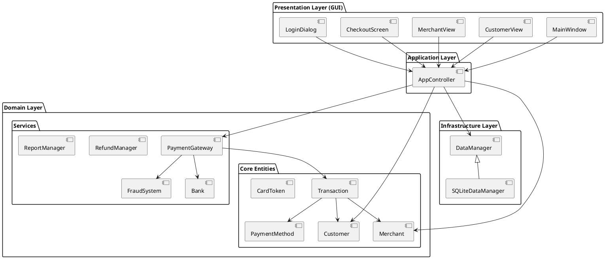
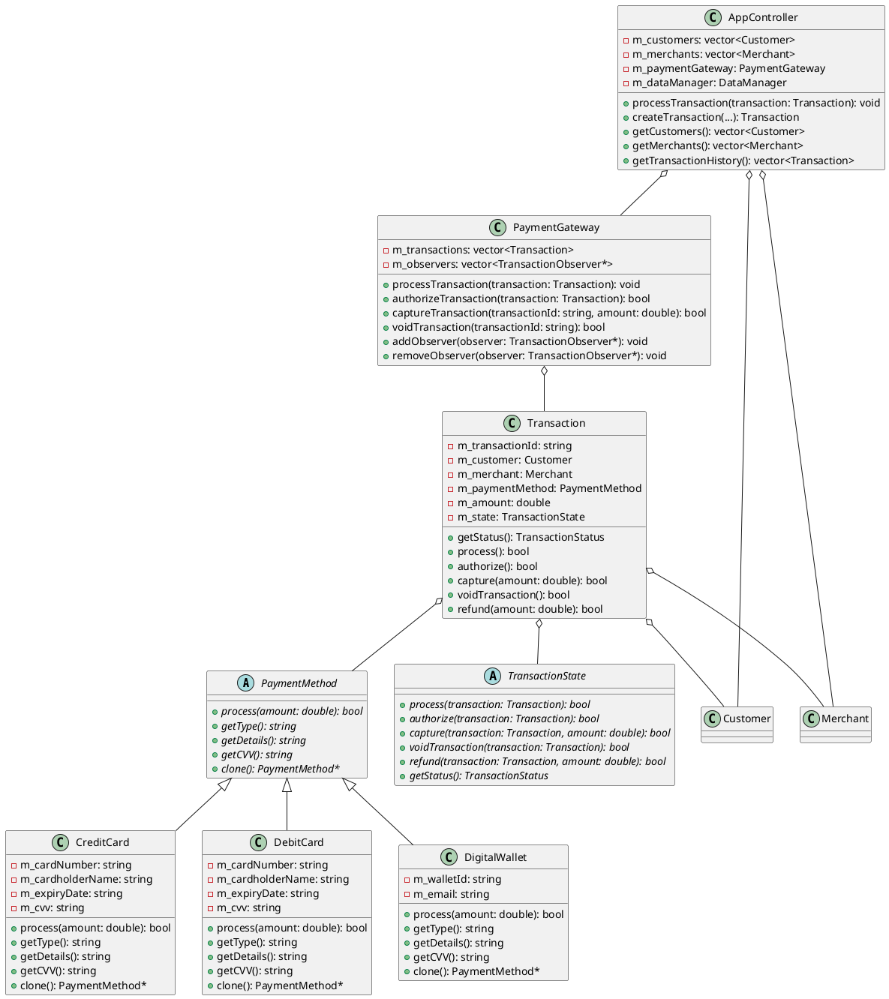
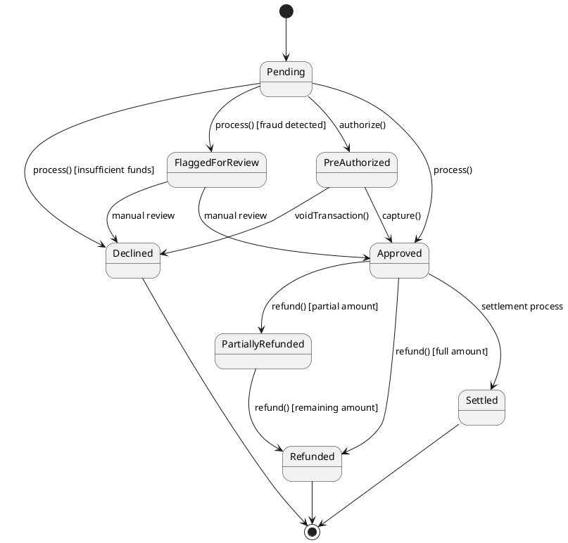

# SecurePay Payment Processing System

## Application Overview

SecurePay is a comprehensive payment processing system designed to handle secure financial transactions between customers and merchants. The application provides a robust platform for processing various payment methods including credit cards, debit cards, and digital wallets. It includes features such as:

- Secure payment processing
- Fraud detection and prevention
- Customer and merchant management
- Transaction history tracking
- Refund processing
- Report generation
- Card tokenization for PCI compliance

The system is built with security, extensibility, and maintainability in mind, following industry best practices and design patterns to ensure a robust architecture.

## Architecture

SecurePay follows a layered architecture with clear separation of concerns:

1. **Presentation Layer (GUI)**: Handles user interaction through Qt-based interfaces
2. **Application Layer**: Coordinates activities and manages workflow through the AppController
3. **Domain Layer**: Contains the core business logic and entities
4. **Infrastructure Layer**: Provides technical capabilities like data persistence

### High-Level Architecture Diagram



### Class Diagram (Core Components)



### Transaction State Diagram



## Design Principles

### 1. Single Responsibility Principle (SRP)

Each class in the system has a single responsibility, making the code more maintainable and easier to understand.

**Example**: The `PaymentGateway` class is responsible only for processing payments, while the `FraudSystem` is responsible only for fraud detection.

```cpp
// src/core/paymentgateway.h
class PaymentGateway {
public:
    void processTransaction(std::unique_ptr<Transaction> transaction);
    bool authorizeTransaction(std::unique_ptr<Transaction> transaction);
    bool captureTransaction(const std::string& transactionId, double amount);
    bool voidTransaction(const std::string& transactionId);
    // ...
};

// src/core/fraudsystem.h
class FraudSystem {
public:
    FraudRiskLevel evaluateTransaction(const Transaction& transaction);
    void reportFraud(const Transaction& transaction);
    // ...
};
```

### 2. Open/Closed Principle (OCP)

The system is designed to be open for extension but closed for modification.

**Example**: The `PaymentMethod` hierarchy allows adding new payment methods without modifying existing code.

```cpp
// src/core/paymentmethod.h
class PaymentMethod {
public:
    virtual ~PaymentMethod() = default;
    virtual bool process(double amount) const = 0;
    virtual std::string getType() const = 0;
    virtual std::string getDetails() const = 0;
    virtual std::string getCVV() const = 0;
    virtual PaymentMethod* clone() const = 0;
};

// New payment methods can be added by extending the base class
class CreditCard : public PaymentMethod {
    // Implementation
};

class DebitCard : public PaymentMethod {
    // Implementation
};

class DigitalWallet : public PaymentMethod {
    // Implementation
};
```

### 3. Liskov Substitution Principle (LSP)

Subtypes must be substitutable for their base types without altering the correctness of the program.

**Example**: All transaction states implement the `TransactionState` interface and can be used interchangeably.

```cpp
// src/core/transaction.cpp
class TransactionState {
public:
    virtual bool process(Transaction& transaction) = 0;
    virtual bool authorize(Transaction& transaction) = 0;
    virtual bool refund(Transaction& transaction, double amount) = 0;
    virtual TransactionStatus getStatus() const = 0;
    // ...
};

class PendingState : public TransactionState {
    // Implementation
};

class ApprovedState : public TransactionState {
    // Implementation
};

// Transaction class uses states polymorphically
bool Transaction::process() {
    return m_state->process(*this);
}
```

### 4. Interface Segregation Principle (ISP)

Clients should not be forced to depend on interfaces they do not use.

**Example**: The `DataManager` interface defines only the methods needed by clients.

```cpp
// src/core/datamanager.h
class DataManager {
public:
    virtual ~DataManager() = default;
    virtual bool initialize() = 0;
    virtual bool saveCustomer(const Customer& customer) = 0;
    virtual bool saveMerchant(const Merchant& merchant) = 0;
    virtual bool saveTransaction(const Transaction& transaction) = 0;
    // ...
};
```

### 5. Dependency Inversion Principle (DIP)

High-level modules should not depend on low-level modules. Both should depend on abstractions.

**Example**: The `AppController` depends on the `DataManager` interface, not on the concrete `SQLiteDataManager`.

```cpp
// src/core/appcontroller.h
class AppController {
private:
    std::unique_ptr<DataManager> m_dataManager;
    
public:
    AppController() {
        // Initialize with a specific implementation
        m_dataManager = std::make_unique<SQLiteDataManager>("securepay.db");
    }
    // ...
};
```

## Design Patterns

### 1. Strategy Pattern

The Strategy pattern is used to define a family of algorithms, encapsulate each one, and make them interchangeable.

**Implementation**: The `PaymentMethod` hierarchy implements the Strategy pattern.

```cpp
// src/core/paymentmethod.h
class PaymentMethod {
public:
    virtual bool process(double amount) const = 0;
    // ...
};

// Different strategies for processing payments
class CreditCard : public PaymentMethod {
public:
    bool process(double amount) const override {
        std::cout << "Processing credit card payment of $" << amount << std::endl;
        return amount < 10000.0;
    }
    // ...
};

class DebitCard : public PaymentMethod {
public:
    bool process(double amount) const override {
        std::cout << "Processing debit card payment of $" << amount << std::endl;
        return amount < 5000.0;
    }
    // ...
};
```

**Benefits**: 
- Allows the system to support multiple payment methods
- New payment methods can be added without changing existing code
- Payment processing algorithms can be selected at runtime

### 2. State Pattern

The State pattern allows an object to alter its behavior when its internal state changes.

**Implementation**: The `Transaction` class uses the State pattern to manage transaction states.

```cpp
// src/core/transaction.h
class Transaction {
private:
    std::unique_ptr<TransactionState> m_state;
    
public:
    bool process() {
        return m_state->process(*this);
    }
    
    void setState(std::unique_ptr<TransactionState> state) {
        m_state = std::move(state);
    }
    // ...
};

// src/core/transaction.cpp
bool PendingState::process(Transaction& transaction) {
    // Process the transaction
    // ...
    transaction.setState(std::make_unique<ApprovedState>());
    return true;
}
```

**Benefits**:
- Encapsulates state-specific behavior
- Makes state transitions explicit
- Simplifies the code by eliminating complex conditional statements

### 3. Observer Pattern

The Observer pattern defines a one-to-many dependency between objects so that when one object changes state, all its dependents are notified and updated automatically.

**Implementation**: The `PaymentGateway` uses the Observer pattern to notify interested parties about transaction updates.

```cpp
// src/core/paymentgateway.h
class TransactionObserver {
public:
    virtual void onTransactionUpdated(const Transaction& transaction) = 0;
};

class PaymentGateway {
private:
    std::vector<TransactionObserver*> m_observers;
    
public:
    void addObserver(TransactionObserver* observer) {
        if (observer) {
            m_observers.push_back(observer);
        }
    }
    
    void removeObserver(TransactionObserver* observer) {
        auto it = std::find(m_observers.begin(), m_observers.end(), observer);
        if (it != m_observers.end()) {
            m_observers.erase(it);
        }
    }
    
    void notifyObservers(const Transaction& transaction) {
        for (auto observer : m_observers) {
            observer->onTransactionUpdated(transaction);
        }
    }
    // ...
};
```

**Benefits**:
- Loose coupling between the payment gateway and its observers
- Allows multiple components to react to transaction updates
- Simplifies event handling

### 4. Singleton Pattern

The Singleton pattern ensures a class has only one instance and provides a global point of access to it.

**Implementation**: The `Bank`, `FraudSystem`, and `ReportManager` classes use the Singleton pattern.

```cpp
// src/core/bank.h
class Bank {
public:
    static Bank& getInstance() {
        static Bank instance;
        return instance;
    }
    
    // Delete copy constructor and assignment operator
    Bank(const Bank&) = delete;
    Bank& operator=(const Bank&) = delete;
    
private:
    Bank();  // Private constructor
    // ...
};
```

**Benefits**:
- Ensures a single instance of critical system components
- Provides a global access point
- Controls access to shared resources

### 5. Factory Method Pattern

The Factory Method pattern defines an interface for creating an object, but lets subclasses decide which class to instantiate.

**Implementation**: The `PaymentMethodFactory` class implements the Factory Method pattern.

```cpp
// src/core/paymentmethod.h
class PaymentMethodFactory {
public:
    static std::unique_ptr<PaymentMethod> createCreditCard(
        const std::string& cardNumber, const std::string& cardholderName,
        const std::string& expiryDate, const std::string& cvv);
        
    static std::unique_ptr<PaymentMethod> createDebitCard(
        const std::string& cardNumber, const std::string& cardholderName,
        const std::string& expiryDate, const std::string& cvv);
        
    static std::unique_ptr<PaymentMethod> createDigitalWallet(
        const std::string& walletId, const std::string& email);
};

// src/core/paymentmethod.cpp
std::unique_ptr<PaymentMethod> PaymentMethodFactory::createCreditCard(
    const std::string& cardNumber, const std::string& cardholderName,
    const std::string& expiryDate, const std::string& cvv) {
    return std::make_unique<CreditCard>(cardNumber, cardholderName, expiryDate, cvv);
}
```

**Benefits**:
- Encapsulates object creation logic
- Provides a consistent interface for creating different payment methods
- Simplifies client code

### 6. Facade Pattern

The Facade pattern provides a unified interface to a set of interfaces in a subsystem, making it easier to use.

**Implementation**: The `PaymentGatewayFacade` class implements the Facade pattern.

```cpp
// src/core/paymentgatewayfacade.h
class PaymentGatewayFacade {
private:
    PaymentGateway& m_paymentGateway;
    Bank& m_bank;
    FraudSystem& m_fraudSystem;
    
public:
    PaymentGatewayFacade(PaymentGateway& paymentGateway, Bank& bank, FraudSystem& fraudSystem)
        : m_paymentGateway(paymentGateway), m_bank(bank), m_fraudSystem(fraudSystem) {}
    
    bool processPayment(const Customer& customer, const Merchant& merchant,
                       std::unique_ptr<PaymentMethod> paymentMethod, double amount);
    // ...
};
```

**Benefits**:
- Simplifies the interface to complex subsystems
- Reduces dependencies between client code and subsystems
- Improves code readability and maintainability

### 7. Decorator Pattern

The Decorator pattern attaches additional responsibilities to an object dynamically, providing a flexible alternative to subclassing.

**Implementation**: The `TransactionDecorator` class implements the Decorator pattern.

```cpp
// src/core/transactiondecorator.h
class TransactionDecorator : public Transaction {
protected:
    std::unique_ptr<Transaction> m_wrappedTransaction;
    
public:
    TransactionDecorator(std::unique_ptr<Transaction> transaction)
        : m_wrappedTransaction(std::move(transaction)) {}
    
    std::string getTransactionId() const override {
        return m_wrappedTransaction->getTransactionId();
    }
    
    // Other overridden methods
    // ...
};

class LoggingTransactionDecorator : public TransactionDecorator {
public:
    LoggingTransactionDecorator(std::unique_ptr<Transaction> transaction)
        : TransactionDecorator(std::move(transaction)) {}
    
    bool process() override {
        std::cout << "Logging: Processing transaction " << getTransactionId() << std::endl;
        bool result = m_wrappedTransaction->process();
        std::cout << "Logging: Transaction " << getTransactionId() 
                  << " processed with result: " << result << std::endl;
        return result;
    }
    // ...
};
```

**Benefits**:
- Adds functionality to objects without modifying their structure
- Provides a flexible alternative to subclassing
- Allows combining multiple decorators for complex behavior

### 8. Proxy Pattern

The Proxy pattern provides a surrogate or placeholder for another object to control access to it.

**Implementation**: The `LazyReport` class implements the Proxy pattern.

```cpp
// src/core/lazyreport.h
class Report {
public:
    virtual ~Report() = default;
    virtual std::string generate() = 0;
};

class LazyReport : public Report {
private:
    std::unique_ptr<Report> m_realReport;
    std::string m_reportType;
    std::string m_cachedReport;
    bool m_isGenerated;
    
public:
    LazyReport(const std::string& reportType)
        : m_reportType(reportType), m_isGenerated(false) {}
    
    std::string generate() override {
        if (!m_isGenerated) {
            // Create the real report only when needed
            if (m_reportType == "transaction") {
                m_realReport = std::make_unique<TransactionReport>();
            } else if (m_reportType == "customer") {
                m_realReport = std::make_unique<CustomerReport>();
            }
            
            if (m_realReport) {
                m_cachedReport = m_realReport->generate();
                m_isGenerated = true;
            }
        }
        
        return m_cachedReport;
    }
};
```

**Benefits**:
- Lazy initialization of resource-intensive objects
- Caching of results for better performance
- Control over access to the real object

## Conclusion

The SecurePay Payment Processing System demonstrates the application of numerous design principles and patterns to create a robust, maintainable, and extensible architecture. By following SOLID principles and leveraging appropriate design patterns, the system achieves:

1. Clear separation of concerns
2. High cohesion and low coupling
3. Extensibility for new payment methods and features
4. Robust state management for transactions
5. Efficient resource utilization

These architectural decisions contribute to a system that is not only functional and secure but also adaptable to changing requirements and easy to maintain over time.
