# SecurePay Payment Processing System - Class Diagram

This document contains the class diagram for the SecurePay Payment Processing System, illustrating the architecture and relationships between key components.

## Core Domain Model

```mermaid
classDiagram
    %% Core Domain Classes
    class Transaction {
        -string transactionId
        -string idempotencyKey
        -Customer customer
        -Merchant merchant
        -PaymentMethod paymentMethod
        -double amount
        -double refundedAmount
        -TransactionState state
        -timestamp
        +getTransactionId() string
        +getCustomer() Customer
        +getMerchant() Merchant
        +getPaymentMethod() PaymentMethod
        +getAmount() double
        +getRemainingAmount() double
        +getRefundedAmount() double
        +getStatus() TransactionStatus
        +process() bool
        +authorize() bool
        +capture(amount) bool
        +voidTransaction() bool
        +refund(amount) bool
        +setState(state) void
    }

    class TransactionState {
        <<interface>>
        +process(Transaction) bool
        +authorize(Transaction) bool
        +capture(Transaction, amount) bool
        +voidTransaction(Transaction) bool
        +refund(Transaction, amount) bool
        +getStatus() TransactionStatus
        +toString() string
    }

    class PendingState {
        +process(Transaction) bool
        +authorize(Transaction) bool
        +refund(Transaction, amount) bool
        +getStatus() TransactionStatus
        +toString() string
    }

    class ApprovedState {
        +process(Transaction) bool
        +refund(Transaction, amount) bool
        +getStatus() TransactionStatus
        +toString() string
    }

    class RefundedState {
        +process(Transaction) bool
        +refund(Transaction, amount) bool
        +getStatus() TransactionStatus
        +toString() string
    }

    class PartiallyRefundedState {
        +process(Transaction) bool
        +refund(Transaction, amount) bool
        +getStatus() TransactionStatus
        +toString() string
    }

    class Customer {
        -string userId
        -string name
        -string email
        -string billingAddress
        -map<string, double> balances
        +getName() string
        +getEmail() string
        +getBillingAddress() string
        +getBalance(paymentMethodType) double
        +setBalance(paymentMethodType, amount) void
        +deduct(paymentMethodType, amount) bool
        +authenticate(usernameOrEmail, pin) bool
    }

    class Merchant {
        -string id
        -string name
        -string email
        -string address
        +getName() string
        +getEmail() string
        +getAddress() string
    }

    class PaymentMethod {
        <<abstract>>
        -string type
        +getType() string
        +validate() bool
    }

    class CreditCard {
        -string cardNumber
        -string cardholderName
        -string expiryDate
        -string cvv
        +validate() bool
    }

    class DebitCard {
        -string cardNumber
        -string cardholderName
        -string expiryDate
        -string cvv
        +validate() bool
    }

    class DigitalWallet {
        -string walletId
        -string email
        +validate() bool
    }

    class CardToken {
        -string token
        -string customerId
        -string lastFourDigits
        -string cardholderName
        -string expiryMonth
        -string expiryYear
        -CardCategory category
        +getToken() string
        +getCustomerId() string
        +getLastFourDigits() string
        +getDisplayName() string
    }

    class Refund {
        -string refundId
        -string transactionId
        -double amount
        -string reason
        -timestamp
        +getRefundId() string
        +getTransactionId() string
        +getAmount() double
        +getReason() string
        +getTimestamp() string
    }

    class FraudAlert {
        -string alertId
        -string transactionId
        -RiskLevel riskLevel
        -double riskScore
        -string description
        -timestamp
        +getAlertId() string
        +getTransactionId() string
        +getRiskLevel() RiskLevel
        +getRiskScore() double
        +getDescription() string
        +getTimestamp() string
    }

    %% Manager Classes
    class AppController {
        -vector<Customer> customers
        -vector<Merchant> merchants
        -PaymentGateway paymentGateway
        -PaymentGatewayFacade paymentGatewayFacade
        -DataManager dataManager
        +addCustomer(customer) Customer
        +findCustomerByUserId(userId) Customer
        +authenticateCustomer(usernameOrEmail, pin) Customer
        +addMerchant(merchant) void
        +createTransaction(...) Transaction
        +processTransaction(transaction) void
        +getTransactionHistory() vector<Transaction>
    }

    class PaymentGateway {
        -vector<Transaction> transactions
        -vector<Observer> observers
        +processTransaction(transaction) void
        +authorizeTransaction(transaction) bool
        +captureTransaction(transactionId, amount) bool
        +voidTransaction(transactionId) bool
        +findTransaction(transactionId) Transaction
        +getTransactions() vector<Transaction>
        +addObserver(observer) void
        +removeObserver(observer) void
        +notifyObservers(transaction) void
    }

    class PaymentGatewayFacade {
        -PaymentGateway paymentGateway
        -Bank bank
        -FraudSystem fraudSystem
        +processTransaction(transaction) void
        +authorizeTransaction(transaction) bool
        +captureTransaction(transactionId, amount) bool
        +voidTransaction(transactionId) bool
    }

    class RefundManager {
        -vector<Refund> refunds
        -vector<Customer>* customers
        +processFullRefund(transaction, reason) bool
        +processPartialRefund(transaction, amount, reason) bool
        +getRefunds() vector<Refund>
        +setCustomers(customers) void
    }

    class ReportManager {
        -PaymentGateway* paymentGateway
        +generateTransactionReport(criteria) Report
        +generateRefundReport(criteria) Report
        +generateFraudReport(criteria) Report
        +exportReport(report, format, filePath) bool
        +setPaymentGateway(paymentGateway) void
    }

    class Bank {
        +processPayment(transaction) bool
        +authorizePayment(transaction) bool
        +capturePayment(transaction, amount) bool
        +voidPayment(transaction) bool
        +refundPayment(transaction, amount) bool
    }

    class FraudSystem {
        +checkTransaction(transaction) FraudCheckResult
        +flagTransaction(transaction, reason) void
        +getFraudAlerts() vector<FraudAlert>
    }

    class EnhancedFraudSystem {
        -FraudSystem baseFraudSystem
        -vector<FraudRule> rules
        +checkTransaction(transaction) FraudCheckResult
        +addRule(rule) void
        +removeRule(ruleId) void
    }

    class DataManager {
        <<interface>>
        +initialize() bool
        +saveCustomer(customer) bool
        +loadCustomers() vector<Customer>
        +saveMerchant(merchant) bool
        +loadMerchants() vector<Merchant>
        +saveTransaction(transaction) bool
        +loadTransactions(...) vector<Transaction>
        +saveCardToken(cardToken) bool
        +loadCardTokens() vector<CardToken>
    }

    class SQLiteDataManager {
        -string dbPath
        -SQLiteConnection connection
        +initialize() bool
        +saveCustomer(customer) bool
        +loadCustomers() vector<Customer>
        +saveMerchant(merchant) bool
        +loadMerchants() vector<Merchant>
        +saveTransaction(transaction) bool
        +loadTransactions(...) vector<Transaction>
        +saveCardToken(cardToken) bool
        +loadCardTokens() vector<CardToken>
    }

    %% UI Classes
    class MainWindow {
        -AppController appController
        -QStackedWidget mainStack
        -CustomerView customerView
        -MerchantView merchantView
        +setupUI() void
        +onRoleChanged(index) void
        +onTransactionUpdated(transaction) void
    }

    class CustomerView {
        -AppController appController
        -QTableWidget transactionTable
        -QLabel customerDetailsLabel
        -QLabel balanceLabel
        +updateCustomerDetails() void
        +updateTransactionHistory() void
        +updateBalanceDisplay() void
        +onSubmitClicked() void
        +onDepositClicked() void
    }

    class MerchantView {
        -AppController appController
        -QTableWidget transactionTable
        -QTableWidget refundTable
        -QTableWidget fraudAlertTable
        -QLabel merchantDetailsLabel
        +updateTransactionHistory() void
        +updateRefundHistory() void
        +updateFraudAlerts() void
        +onProcessRefundClicked() void
    }

    class RefundDialog {
        -vector<Transaction> transactions
        -RefundManager refundManager
        -QComboBox transactionComboBox
        -QLabel transactionDetailsLabel
        -QRadioButton fullRefundRadio
        -QRadioButton partialRefundRadio
        -QLineEdit amountEdit
        -QTextEdit reasonEdit
        +setupUI() void
        +onTransactionSelected(index) void
        +onRefundTypeSelected(checked) void
        +processRefund() void
    }

    %% Relationships
    Transaction *-- TransactionState
    TransactionState <|.. PendingState
    TransactionState <|.. ApprovedState
    TransactionState <|.. RefundedState
    TransactionState <|.. PartiallyRefundedState
    Transaction o-- Customer
    Transaction o-- Merchant
    Transaction o-- PaymentMethod
    PaymentMethod <|-- CreditCard
    PaymentMethod <|-- DebitCard
    PaymentMethod <|-- DigitalWallet
    AppController o-- PaymentGateway
    AppController o-- PaymentGatewayFacade
    AppController o-- DataManager
    PaymentGatewayFacade o-- PaymentGateway
    PaymentGatewayFacade o-- Bank
    PaymentGatewayFacade o-- FraudSystem
    FraudSystem <|-- EnhancedFraudSystem
    DataManager <|.. SQLiteDataManager
    MainWindow o-- CustomerView
    MainWindow o-- MerchantView
    CustomerView o-- AppController
    MerchantView o-- AppController
    MerchantView o-- RefundManager
    RefundDialog o-- RefundManager
```

## Design Patterns Used

The SecurePay Payment Processing System implements several design patterns:

1. **Singleton Pattern**: Used in classes like `Bank`, `FraudSystem`, `RefundManager`, and `ReportManager` to ensure only one instance exists.

2. **State Pattern**: Used for transaction states (`PendingState`, `ApprovedState`, `RefundedState`, etc.) to encapsulate state-specific behavior.

3. **Facade Pattern**: `PaymentGatewayFacade` provides a simplified interface to the complex subsystem of payment processing.

4. **Observer Pattern**: Used in `PaymentGateway` to notify observers when transactions are updated.

5. **Factory Method Pattern**: `TransactionFactory` creates transactions with different configurations.

6. **Decorator Pattern**: `TransactionDecorator` adds additional functionality to transactions.

7. **Strategy Pattern**: Used in the fraud detection system to apply different fraud detection rules.

8. **MVC Pattern**: The overall architecture separates the model (core classes), view (UI classes), and controller (AppController).

## Package Structure

The system is organized into two main packages:

1. **Core**: Contains the business logic and domain model classes
   - Transaction processing
   - Payment methods
   - Customer and merchant management
   - Fraud detection
   - Data management

2. **GUI**: Contains the user interface components
   - Main window
   - Customer view
   - Merchant view
   - Various dialogs for specific operations
